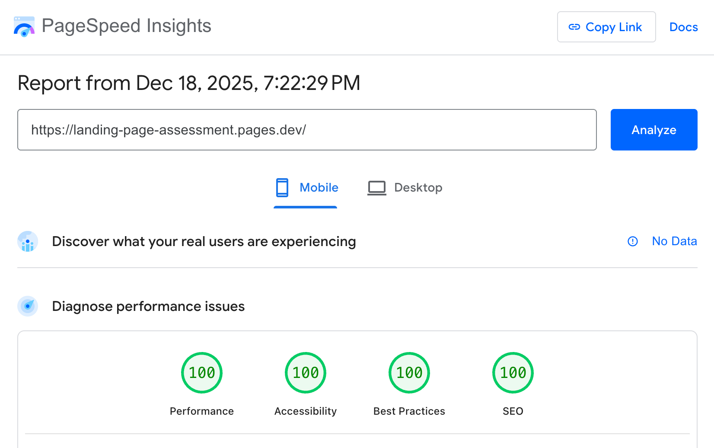
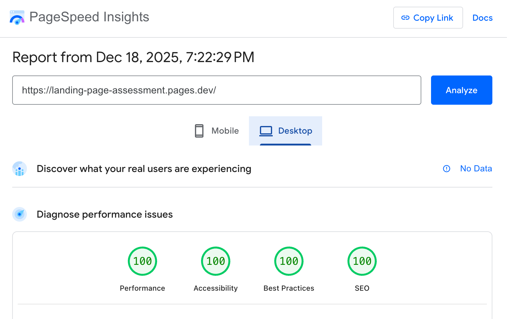

# Accessible Landing Page

> **Note:** Built within assessment timeframe & prioritizing its requirements. Content and copy are intentionally minimal- with a real product and brand guidelines, this would likely be significantly expanded. Features automatic dark mode via `prefers-color-scheme`, respects `prefers-reduced-motion` for animations, and tested it on the latest Chrome/Firefox/Safari. Form submission is currently simulated.

## Quick Start

```bash
npm install
npm run dev      # Development server
npm run build    # Production build
npm run preview  # Preview production build
```

## Tech Stack

- Vite: Build tool
- Vanilla JS
- SCSS for styling

## Lighthouse / PageSpeed Insights Scores

### Mobile


### Desktop

